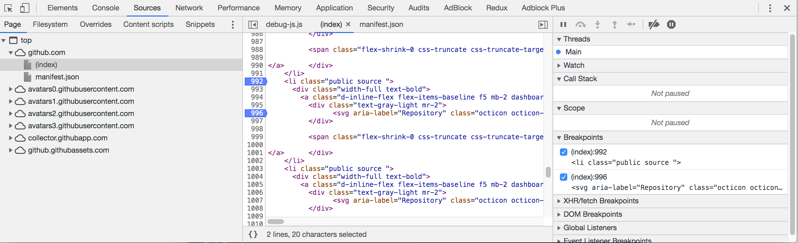

## Developer tools
### Chrome Snippets tool
It is possible to create, save and run snippets on every page instead of manually loading it each time.
example: 


### Breakpoint


#### Copy command
using the `copy` command on the consile, you can easily copy data directly to your clipboard.

Add `copy-snippet.js` to your snippets folder.

### Debug command 

Define small function: 

```
function test(limit) {
    for(let i=0; i < limit; i++) {
        console.log(i);
    }
}
debug(test())
```
### Pause execution

Press `F8` for pausing and inspect element for hover.
<!-- TODO: add image -->