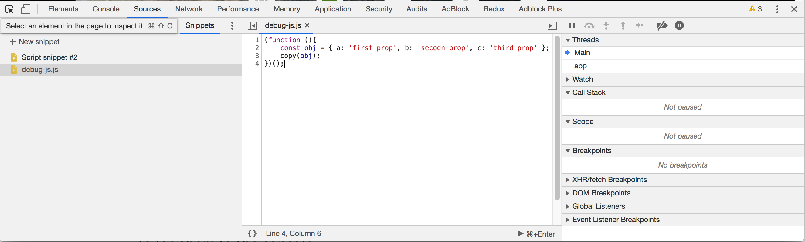

## Developer tools
### Chrome Snippets tool
It is possible to create, save and run snippets on every page instead of manually loading it each time.
example: 

#### Copy command
using the `copy` command on the consile, you can easily copy data directly to your clipboard.

Add `copy-snippet.js` to your snippets folder.

debug
monitor
F8 pausing execution and then inspect element for hover.