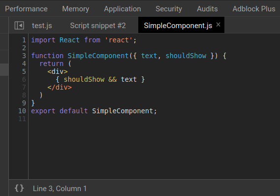

# React debugging tutorial
### Running simple react app

```
cd app
yarn start
```

Simple component view


Clicking on <> with jump to the source code of the selected component:



Clicking on &#128065; "Inspecting matching DOM element" will highlight the selected component and show the DOM element on the Elements tab:

